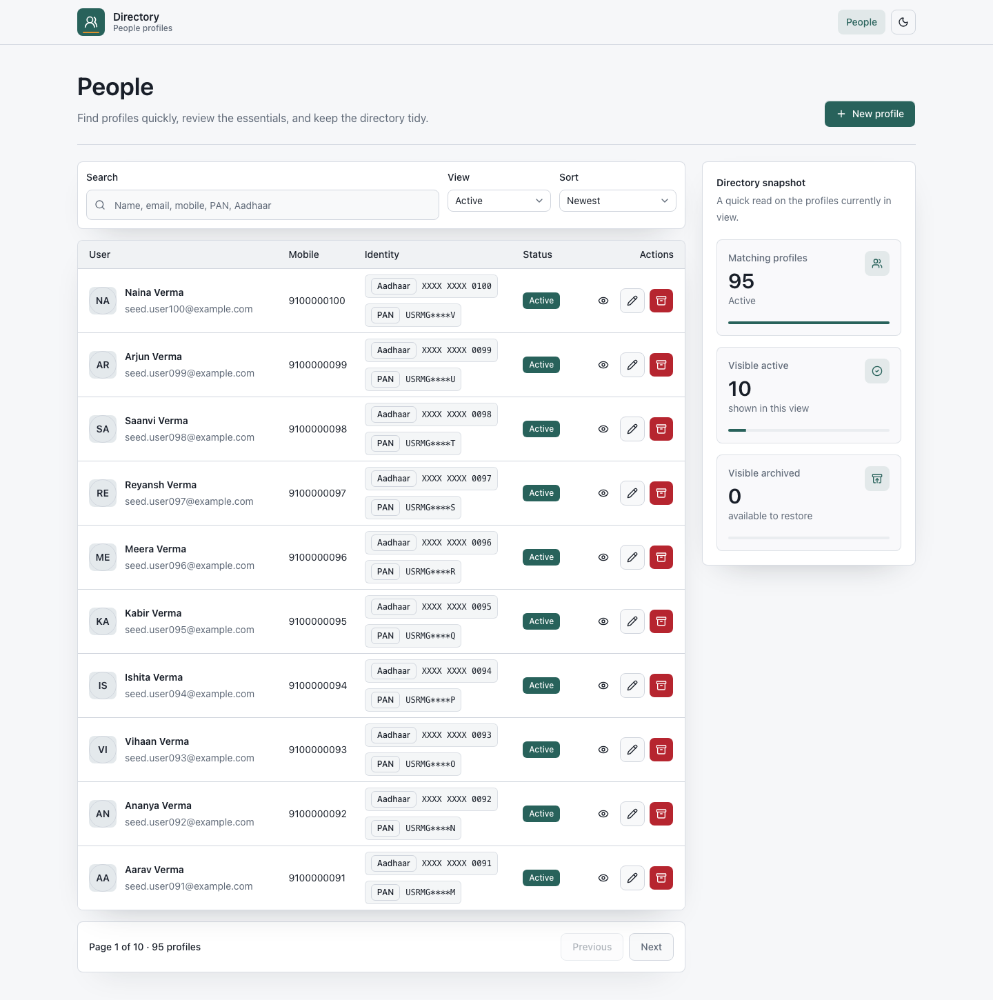
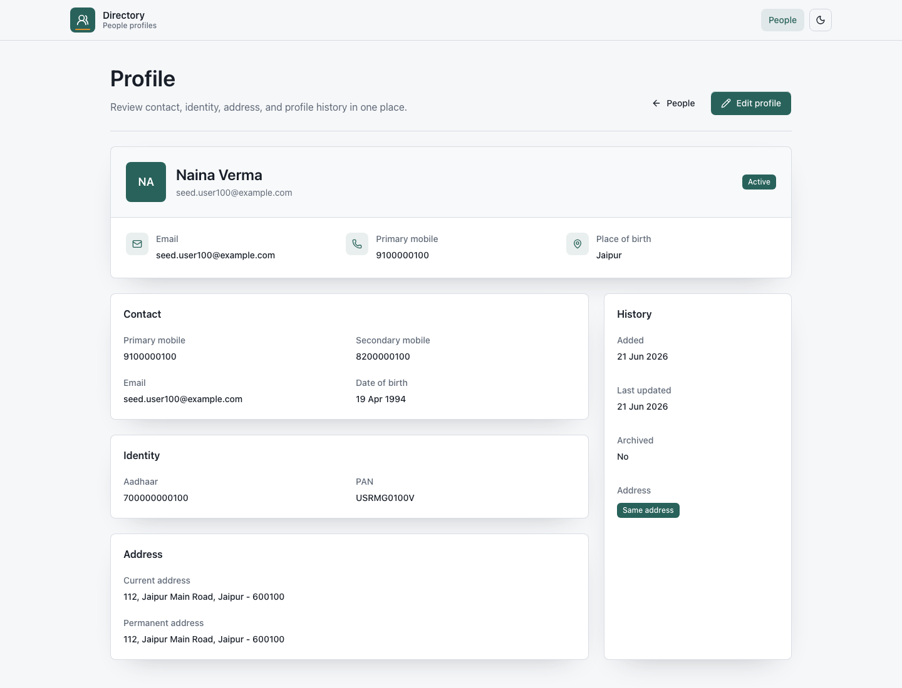
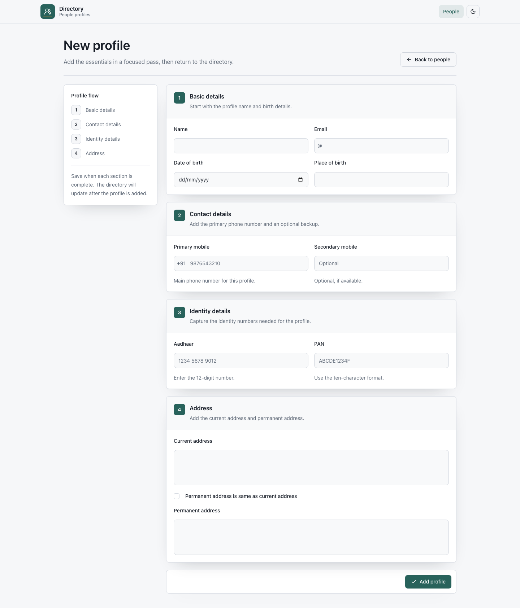

# Directory

A simple user management app that lets users create, view, update, archive, and restore profiles. It has a clean, easy-to-use interface with clear navigation and accessible controls.


## Screenshots

### People workspace



### Profile detail



### New profile flow



## Project Structure

* **backend/** – Contains the Express API, MySQL database logic, input validation, and all backend tests.
* **frontend/** – Contains the React application, built with Vite, styled using Tailwind CSS, and uses shadcn-inspired UI components.
* **docs/** – Stores project screenshots and other supporting files used for documentation.

## Prerequisites

- Node.js 20+
- npm
- Docker, for the local MySQL database

## Local Setup

Start MySQL:

```bash
docker compose up -d
```

Install and run the backend:

```bash
cd backend
npm install
npm run db:migrate
npm run db:seed
npm run dev
```

Install and run the frontend:

```bash
cd frontend
npm install
npm run dev
```

The app runs at [http://localhost:5173](http://localhost:5173). The API defaults to `http://localhost:4000/api/v1`.


## Testing

The backend tests use Vitest and Supertest to check how the APIs work. They interact with the app through its repository layer, so the tests can run without needing a real database.

